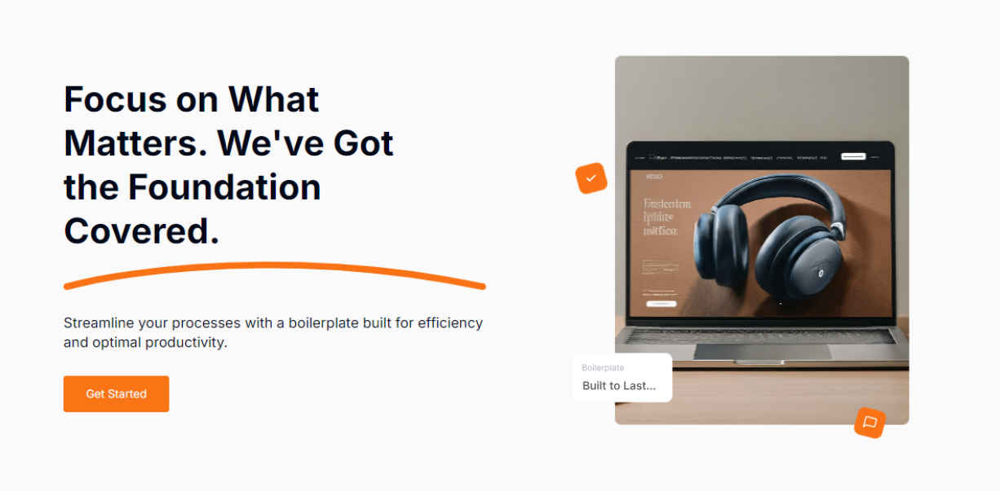

# **TEAM STARLIGHT BOILERPLATE REGRESSION TEST REPORTS**

## **👋 Introduction**

The purpose of this report is to summarize the findings from the regression, functionality and UI tests conducted on the [Boilerplate](https://starlight-nestjs.teams.hng.tech/). The test aimed to verify that recent changes or updates did not negatively impact existing functionalities.

#

**Testers**: 

* Edwin Gloria  
* Pauline Banye  
* Umeh Johnbosco

**Environment**

* Operating System: macOS, Windows 10  
* Browser: Chrome (127.0.6533.99) & Brave ([Version 1.67.134](https://brave.com/latest/))

**Test Links**

* Frontend: [Live link](https://starlight-nestjs.teams.hng.tech/)  
* Design: [Figma](https://www.figma.com/design/VEItfX6St5NSAqqNHImcxD/HNG-Boilerplate-Designs?node-id=3-11896\&t=P54Is40ozK8ZGQPQ-0)  
* Test Result: [Result](https://drive.google.com/drive/folders/1S7oMpLqiZj1dEWaQMe6mbluPTXYX7kgG?usp=sharing)

**Tools**

* Cypress  
* VS Code